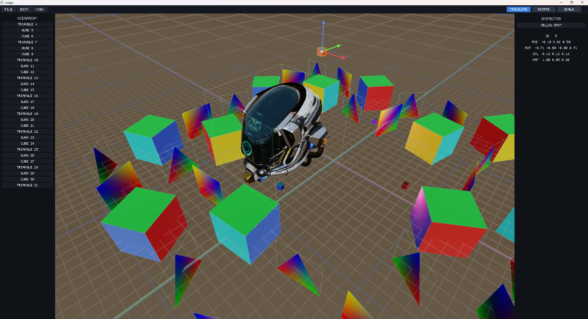

<h1 align="center">indigo</h1>

  
  

<strong>A data-oriented game engine written in Go with a custom ECS. Works on Windows, Linux, macOS, and the web.</strong>

Archetype ECS, a wgpu-backed render graph with clustered lighting and image-based PBR, and a retained ECS-driven UI. Runs on GLFW on the desktop and on WebAssembly + canvas in the browser. Engine state lives as components on world entities, systems are plain `func(*ecs.World)` functions, and the renderer reads from the same world the simulation writes to.

The editor ships in this repository as the end-to-end consumer.

[Editor in the browser](https://matthewberger.dev/indigo/editor/) (WebGPU required).

Architecture notes are in [docs/ARCHITECTURE.md](docs/ARCHITECTURE.md).

Dual-licensed under [MIT](LICENSE-MIT) or [Apache-2.0](LICENSE-APACHE) at your option.
