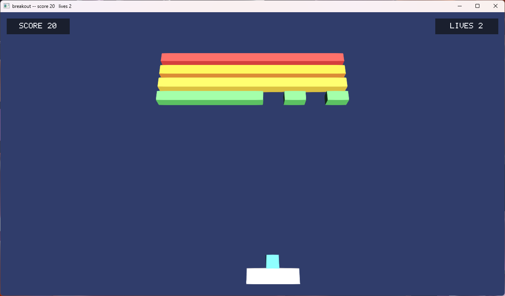

# indigo

An early game engine written in Go. Data-oriented from the ground up:
archetype ECS, a `wgpu`-backed render graph with declarative passes,
dual-world simulation and renderer separation, free-function systems
wired through a named schedule. Runs natively (GLFW) and on the web
(WebAssembly + canvas).

[](https://matthewberger.dev/indigo/editor/)

[Play the editor in your browser](https://matthewberger.dev/indigo/editor/) (requires a WebGPU-capable browser).

[](https://matthewberger.dev/indigo/breakout/)

[Play breakout in your browser](https://matthewberger.dev/indigo/breakout/).

Architecture notes live in [`docs/ARCHITECTURE.md`](docs/ARCHITECTURE.md).

## Quickstart

```
just run            # editor
just run breakout   # breakout
```

`just --list` for the rest.

## License

Dual-licensed under [MIT](LICENSE-MIT) or [Apache-2.0](LICENSE-APACHE) at your option.
